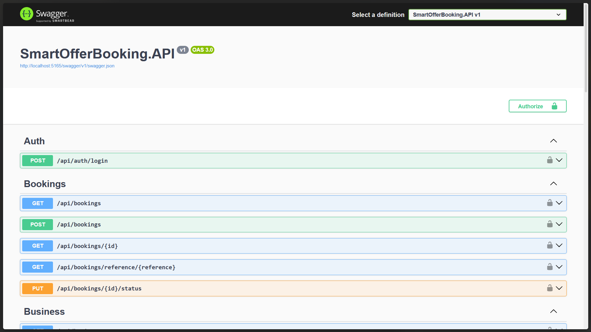

# Smart Offer Slot Booking System

**Objective:** A full-stack web application where a business can create limited-time offer slots, and customers can reserve those offers through a public booking page. This system is designed for service-based businesses like restaurants, gyms, salons, clinics, coaching classes, gaming zones, turfs, spas, or activity centers.

## 🚀 Tech Stack

### Frontend
- **Framework:** React + TypeScript / TSX
- **Styling:** Tailwind CSS

### Backend
- **Framework:** .NET 8 Web API
- **Database:** PostgreSQL or SQL Server
- **API Documentation:** Swagger / OpenAPI

---

## 👥 User Roles

1. **Admin / Business Owner:** Can create and manage offers, slots, bookings, and the business profile.
2. **Customer:** Can view active offers and book a slot through the public page.

---

## ✨ Features

### 1. Admin Login & Dashboard
- Secure login via Email and Password.
- Dashboard displaying: Total Offers, Active Offers, Total Bookings, Today’s Bookings, Total Capacity, Booked Seats, Available Seats, and Conversion Rate.
- Recent bookings table with customer details and status.

### 2. Business Profile Management
- Create and edit business profiles (Name, Type, Owner, Phone, Email, Address, City, Opening/Closing Times, Logo).

### 3. Offer & Slot Management
- Create offers with custom pricing (Original vs. Offer Price), capacity, booking limits, and start/end dates.
- Manage multiple time slots for each offer (e.g., 10 AM - 11 AM, Capacity 10).
- Automatic tracking of booked vs. available counts.
- Pause, activate, or cancel offers at any time.

### 4. Public Offer Listing & Details
- Browse active offers with filters for Business Type, Category, Date, Price Range, and Availability.
- View detailed offer information including description, terms, and location.

### 5. Seamless Booking Flow
- Customers can book slots by providing Name, Phone, Number of People, and optional Email/Notes.
- Real-time validation ensures slots aren't overbooked and expired offers aren't selectable.
- Generates a unique Booking Reference Number upon confirmation.

---

## 🗄️ Database Schema Overview

The system uses the following core tables to manage the domain:

- **Users:** Stores Admin credentials and roles.
- **Businesses:** Stores business profile information.
- **Offers:** Contains the core offer details, pricing, and rules.
- **OfferSlots:** Maps specific time slots to offers and tracks capacities.
- **Bookings:** Records customer reservations, linking to specific offers and slots.

---

## 🔌 Core APIs

**Auth & Business**
- `POST /api/auth/login`
- `GET /api/business` | `POST /api/business` | `PUT /api/business/{id}`

**Offers**
- `GET /api/offers` | `POST /api/offers` | `GET /api/offers/{id}`
- `PUT /api/offers/{id}` | `DELETE /api/offers/{id}`

**Slots**
- `GET /api/slots` | `POST /api/slots` | `GET /api/offers/{offerId}/slots`
- `PUT /api/slots/{id}` | `DELETE /api/slots/{id}`

**Bookings**
- `GET /api/bookings` | `POST /api/bookings` | `GET /api/bookings/{id}`
- `PUT /api/bookings/{id}/status`

---

## 🛠️ Setup Instructions

### Prerequisites
- [Node.js](https://nodejs.org/) (v18+)
- [.NET 8 SDK](https://dotnet.microsoft.com/download)
- PostgreSQL or SQL Server

### Frontend Setup
1. Navigate to the frontend directory: `cd frontend`
2. Install dependencies: `npm install`
3. Setup environment variables: Rename `.env.example` to `.env` and configure it.
4. Run the development server: `npm run dev`

### Backend Setup
1. Navigate to the backend directory: `cd backend/SmartOfferBooking`
2. Restore NuGet packages: `dotnet restore`
3. Update connection strings in `appsettings.Development.json` to point to your local DB instance.
4. Apply database migrations (if using Entity Framework): `dotnet ef database update`
5. Run the API: `cd SmartOfferBooking.API` -> `dotnet run`
6. Access Swagger API Docs at `https://localhost:<port>/swagger`

---

## 📌 Hackathon Submission Assets

- **GitHub Repository:** [Insert Link Here]
- **Demo Video (2-3 mins):** [Insert Link Here]
- **Database Schema/ER Diagram:** [Insert Link/Image Here]

### Screenshots

Click to view screenshots

---

*This project is built for the Willovate Hackathon. By participating, we acknowledge and adhere to the originality, integrity, and open-source commercial contribution rules as outlined in the hackathon guidelines.*
